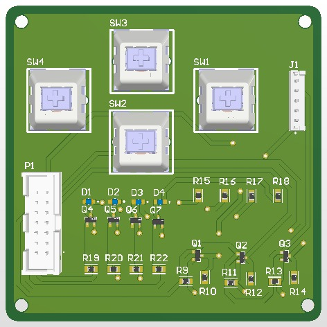
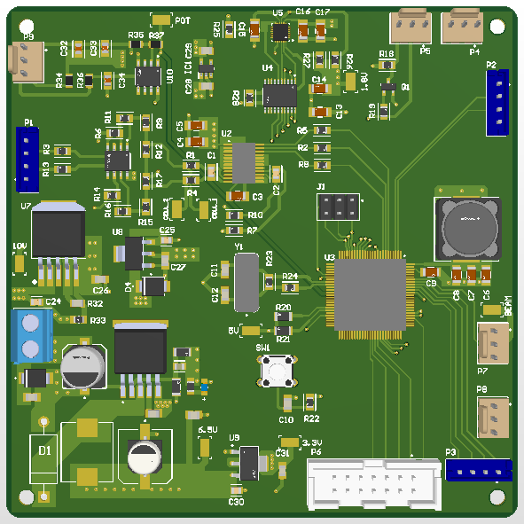

# Zero Gravity Lifting Mechanism

A design project by students of the Department of Electronic & Telecommunication Engineering, University of Moratuwa, Sri Lanka. This project was submitted in partial fulfillment of the requirements for the module **EN2160: Electronic Design Realization**.

---

## 1. Overview

This project focuses on the development of an intelligent "zero-gravity" lifting mechanism designed to assist in the handling and movement of medium-sized loads with minimal physical effort. By dynamically counterbalancing the load, the system allows an operator to maneuver objects as if they were weightless, creating a "float mode" experience.

The primary goals are to enhance workplace safety, reduce operator fatigue, and improve ergonomics in industrial environments such as manufacturing, warehousing, and construction, where repetitive material handling poses risks of strain and injury.

The design process followed the **Inclusive Design Toolkit** from the University of Cambridge, progressing through the phases of *Manage, Explore, Create, and Evaluate* to ensure a user-centric and robust final product.

---

## 2. Team Members

*   **Asuramuni S.Y.**
*   **Dulsara G.M.L.**
*   **Jayawardena H.D.S.S.**
*   **Nethkalana W.K.S.**
*   **Nimantha K.L.W.O.**
*   **Paranayapa D.R.L.W.S.**
*   **Weragoda W.A.A.P.**
*   **Yashodhara M.H.K.**

---

## 3. Key Features

*   **Zero-Gravity Hold Mode**: Dynamically counterbalances the load, allowing for effortless lifting and positioning.
*   **Ergonomic Radial Arm Design**: Provides a large, unobstructed circular workspace, improving accessibility and reducing physical strain.
*   **Intuitive User Interface**: Features an OLED display with graphical cues and a simple four-button control cluster (Up, Down, Select, Back) for easy navigation and operation.
*   **Advanced Safety Features**: Overload detection with warnings ("Object Too Heavy"), and a stable mechanical design.
*   **Multiple Operational Modes**: Includes "Constant Speed," "Linear Control," and "Hold Mode" to adapt to different tasks.
*   **Modular and Scalable**: The design allows for future enhancements and modifications to meet different operational needs.

---

## 4. System Design

The final design is a floor-mounted radial arm that provides rotational and linear reach, powered by a motor and winch system controlled by a custom-designed PCB.

### Final Mechanical Design (SolidWorks)

### Final User Interface
  
  

### System Block Diagram

---

## 5. Technology Stack

### Hardware Components

| Component | Model/Type | Purpose |
| :--- | :--- | :--- |
| **Microcontroller** | ATmega2560 | Main control unit for processing inputs and driving motors. |
| **Load Cell** | LC-50KG (S-Type) | Measures the weight of the load. |
| **ADC** | ADS1232IPWR | 24-Bit ADC for precise load cell signal conversion. |
| **IMU Sensor** | ICM-20948 | 9-Axis motion tracking for advanced control (in future iterations). |
| **Display** | OLED Module | Provides real-time feedback and menu navigation. |
| **Power Supply** | Custom PCB | Includes SMPS and LDOs for 12V, 5V, 3.3V, and 1.8V rails. |

### Software and Tools

| Tool | Usage |
| :--- | :--- |
| **SolidWorks 2020** | 3D modeling of the mechanical structure and enclosure. |
| **Altium Designer** | Schematic capture and PCB design. |
| **MPLAB X IDE** | Firmware development and debugging for the ATmega MCU. |

---

## 6. Finalized PCB Design

A custom 2-layer and 4-layer PCBs were designed in Altium to integrate all control electronics, power management, and sensor interfaces.

   
   

---

## 7. Code Repository

The complete firmware for the ATmega2560 microcontroller is available in the following GitHub repository:

**[https://github.com/HansaniKaumadi/Zero-Gravity-Lifting-Mechanism](https://github.com/HansaniKaumadi/Zero-Gravity-Lifting-Mechanism)**
